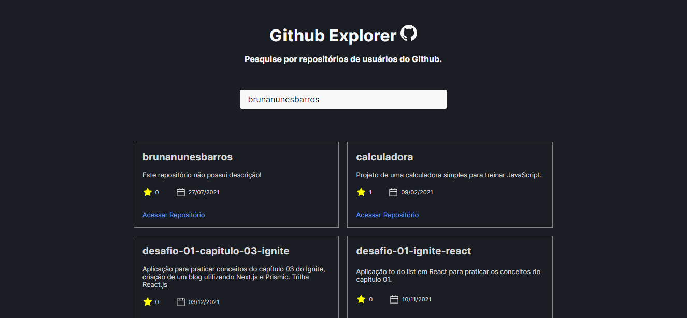
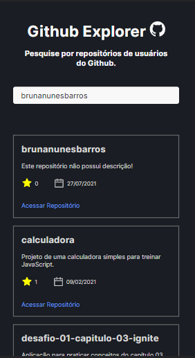

## GITHUB EXPLORER

## Descrição

Aplicação desenvolvida para colocar em prática os conceitos aprendidos nas primeiras aulas do Ignite (trilha de React.js) da [Rockteseat](https://www.rocketseat.com.br/ignite). 

O objetivo é consumir a [API do Github](https://docs.github.com/pt/rest) para que os usuários finais consigam pesquisar por um usuário e encontrar os seus repositórios. 

## O que foi feito?

- Requisições com [fetch](https://developer.mozilla.org/pt-BR/docs/Web/API/Fetch_API/Using_Fetch)
- Criação de um componente para listar os repositórios
- Passagem de props, uso de estado
- Design responsivo
- Pesquisa por usuário com autocomplete
- Utilização de pacotes de terceiros:
- [react-loader-spinner](https://www.npmjs.com/package/react-loader-spinner): spinner para loading entre requisições
- [lodash.debounce](https://lodash.com/docs/4.17.15#debounce): função utiilizada aqui para atrasar chamadas a API no campo de pesquisa do usuário
- [react-icons](https://react-icons.github.io/react-icons/): ícones da aplicação
- [react-hot-toast](https://react-hot-toast.com/): para tratar mensagens de erro

## O que aprendi?

Com essa aplicação reforcei o conceito de consumo de APIs e como tratar os dados da resposta, bem como tipar tais dados, reforçando assim os conceitos de Typescript. Como utilizei o fetch, também pude aprender um pouco sobre como tratar os possíveis erros.

Reforcei conceitos de componentização, passagem de props, uso de bibliotecas, e acredito que o conceito mais novo que introduzi foi o [Debouncing](https://css-tricks.com/debouncing-throttling-explained-examples/). 
O meu problema resumidamente era que a cada letra digitada pelo usuário, o estado era atualizado, através da função onChange na tag input, e isso fazia com que fossem feitas inúmeras requisições. Nesse caso utilizei os chamados [componentes controlados](https://pt-br.reactjs.org/docs/forms.html), onde as mudanças nos formulários são mantidas por um estado. 

De modo geral, o Debouncing é uma técnica que ajuda a lidar com problemas de perfomance nas aplicações, como já descrito, eu precisava de alguma forma minimizar minhas requisições e através de um módulo da biblioteca [lodash](https://lodash.com/), o debounce, que nada mais é que uma forma de garantir que uma função não vai ser executada até que uma certa quantidade de tempo tenha se passado desde a última chamada. 

Sendo assim, eu utilizei esse conceito para que as requisiçõs fossem feitas depois de um tempo em milissegundos, o que simularia o tempo de digitação do usuário. Para isso é utilizado um hook chamado [useCallback](https://pt-br.reactjs.org/docs/hooks-reference.html#usecallback) ao qual utilizei pela primeira vez, não detenho muito conhecimento sobre ele, só utilizei nessa aplicação, mas na documentação do React encontramos que ele recebe como argumentos uma callback e um array, retornando uma versão memoizada da callback, em resumo resolvendo o problema de renderizações desnecessárias, vou deixar aqui o link do detalhamento. No meu caso passei como argumento a função debounce que por sua vez recebe a função que realiza as requisições, e como segundo parâmetro o tempo em milissegundos, e como segundo parâmetro do hook useCallback passei um array vazio. Ressalto que todo esse conceito de Debouncing, useCallback é inicial para mim, cheguei até ele devido o problema descrito acima, com certeza estudarei mais sobre o assunto. 
Por fim, fiquei muito feliz com o resultado visual da aplicação e o fato de que mesmo simples ela me levou a um conceito totalmente novo e ainda a ser explorado. 

## Como ficou? 

  
Versão web:

  

  

    Versão mobile: 
  

  

